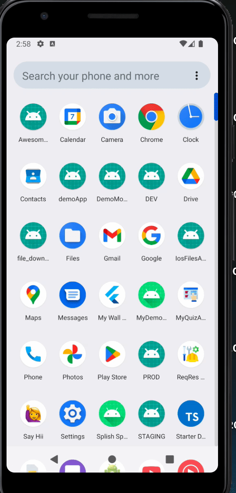

# DemoApp

Demo App

## Features

- List Of Users
- User Info
- Made using `react-navigation V6`

## Usage

To use the application, simply open the app and tap on any user form list.

## Run

To run the application locally

1. Clone this repository to your local machine:
2. cmd `yarn`
3. cmd `yarn android`
4. create APK with cmd `yarn release:android`
